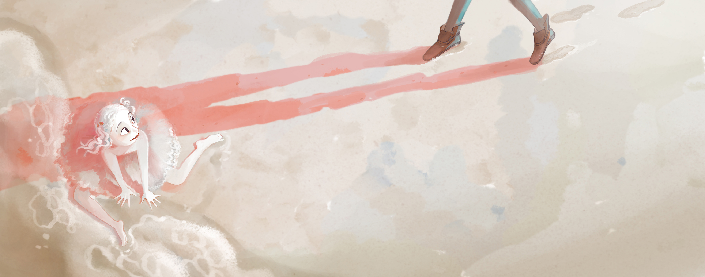

// LANGUAGE: es
// TITLE: La cucarachita mandinga
// CSS: https://minddo-software.github.io/source/style.css
// AUTHOR: Carmen Lyra
// YEAR: 2090
// DESCRIPTION: Descripción

!![source/title1.pdf]
!(100%)
!!

------------START_TEXT-------------

Texto *donde* se hace <referencia[^1]> a la ***nota***.

Nature 2.0 did not come up from the mind of one crazy thinker out of one experience. It is the latest iteration of a years-long thinking process from many crazy thinkers of the world, working together to imagine a future , more beneficial for us all and for the environment and ecosystem we live in.

A major milestone in the history of Nature 2.0 is an article eponym of this community shared on the Medium blogging platform. This article puts down the foundation of the community, explaining its origins, aims and dreams.

!(20%)
!(20%)

Nature 2.0 did not come up from the mind of one crazy thinker out of one experience. It is the latest iteration of a years-long thinking process from many crazy thinkers of the world, working together to imagine a future different, more beneficial for us all and for the environment and ecosystem we live in <different[^2]>.

A major milestone in the history of Nature 2.0 is an article eponym of this community shared on the Medium blogging platform. This article puts down the foundation of the community, explaining its origins, aims and dreams.

## La sirenita

A major milestone in the history of Nature 2.0 is an article eponym of this community shared on the Medium blogging platform. This article puts down the foundation of the community, explaining its origins, aims and dreams.

**Texto acá**

>>> Este es un verso, 
>>> que estoy inventando. 
>>> Si me dejan aquí,
>>> seré una gran poeta.
>>>
>>> Y esta otra linea es mucho más amplia, 
>>> y compleja, aún así jugaré con los tamaños, 
>>> y los haré pequeños
>>> más pequees. 

## La sirenita

A major milestone in the history of Nature 2.0 is an article eponym of this community shared on the Medium blogging platform. This article puts down the foundation of the community, explaining its origins, aims and dreams.

**Texto acá**

[^1]: La nota 1.
[^2]: La nota 2.

--------------END_TEXT-------------

/-----------------------
# Sobre esta edición

**Título**: Los cuentos de mi tía panchita
**Autor**: Carmen Lyra
**Fecha de publicación**: 1920
**Lugar de publicación**: San José, Costa Rica
**Editorial**: Imprenta y Librería Alsina
**Estatus legal**: Libro en dominio público bajo la legislación de Estados Unidos y Costa Rica, siendo este último el país de publicación.

-----------------------/

/-----------------------
# Sobre esta edición

Nature 2.0 did not come up from the mind of one crazy thinker out of one experience. It is the latest iteration of a years-long thinking process from many crazy thinkers of the world, working together to imagine a future different, more beneficial for us all and for the environment and ecosystem we live in.

A major milestone in the history of Nature 2.0 is an article eponym of this community shared on the Medium blogging platform. This article puts down the foundation of the community, explaining its origins, aims and dreams.

-----------------------/

/-----------------------

MindDo © 2020
!(88px)

-----------------------/

