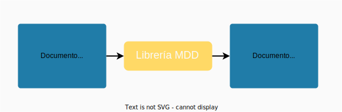
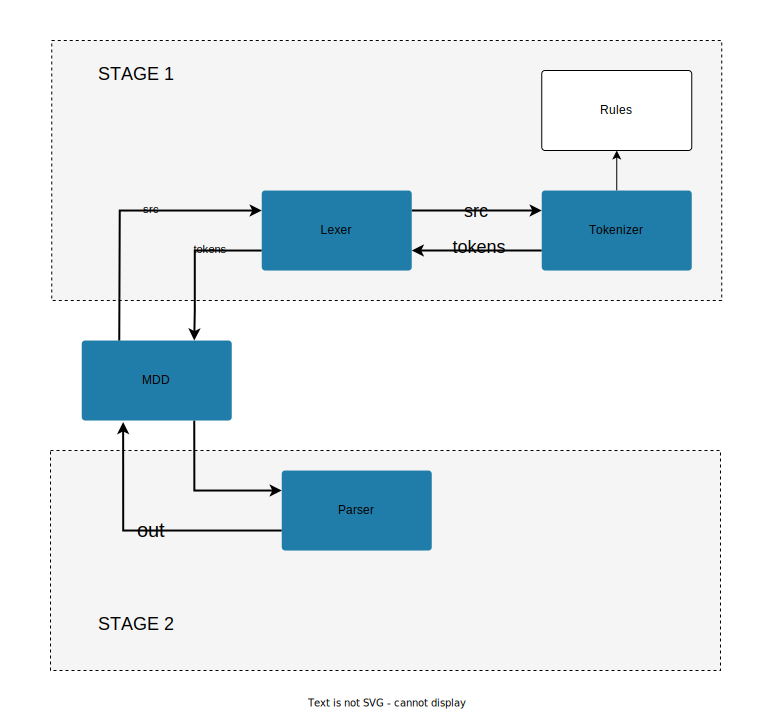

# Librería MDD. Parser md to html

MDD es una librería que transcribe un documento MD a un documento HTML. El objetivo del proyecto es facilitar la producción de páginas web estáticas y que los escritores puedan enfocar su tiempo en la producción de sus textos. 




## Comandos

La librería está programada en Javascript haciendo uso de node.js para la modularizacion del código. Para ejecutar el código es necesario tener instalado node.js y usar un comando con el siguiente formato:

```
node mdd.js [nombre del documento .md] [parámetro de salida: html o latex]
```  

Ejemplo:

```
node mdd.js demo.md html
```

Hacemos uso de browserify para transcribir la librería a un documento javascript que sea accesible desde una página web. 

```
browserify mdd.js --standalone mdd > dist/mdd.min.js
```

## Diseño



El sistema está divido en dos partes. En la primera etapa, el módulo central MDD entrega el documento .md original, el sistema descompone el documento en sus categorizables partes más pequeñas y genera a cambio una lista de tokens. Los tokens son pequeños diccionarios que especifican la información de un elemento. Por ejemplo, si analizamos el siguiente código markdown:

```
# Título

Texto del artículo
```

La lista de tokens resultante será:

```
0:
    type: "title"
    raw: "# Título\n"
    text: "Título"
    
1: 
    type: "paragraph"
    raw: "\nTexto del artículo"
    text: "Texto del artículo"

```


